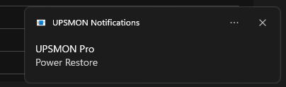

<p align="center">
  <strong>upsmon-toast-notify</strong><br>
  Toast-уведомления Windows вместо модальных окон UPSMON Pro
</p>

<p align="center">
  <a href="https://github.com/fmu1337/upsmon-toast-notify/releases/tag/v3.2.1">Release v3.2.1</a> ·
  <a href="CHANGELOG.md">Changelog</a> ·
  <a href="LICENSE">MIT License</a>
</p>

<p align="center">
  
  
  
  
</p>

---

## О проекте

**upsmon-toast-notify** — drop-in замена штатного `EventMsg.exe` из [UPSMON Pro](https://www.powercom.com/).  
UPSMON по-прежнему сам запускает exe при каждом событии; вместо окна с кнопкой **OK** появляется системный toast.

<p align="center">
  
  <br>
  <sub><em>Power Restore — новое событие перебивает предыдущий toast</em></sub>
</p>

| Было (stock) | Стало |
|--------------|-------|
| Модальное окно, ждёт OK | Toast ~25 сек, со звуком |
| Нужно переключаться на окно | Уведомление в углу экрана |
| Держать процесс не нужно | Запуск → toast → выход |

---

## Возможности

- **Совместимость** — тот же протокол, что у штатного EventMsg (`EventRecord.CSV`, скрытое окно для UPSMON)
- **Замена toast** — Power Failure → Power Restore, Self Test → Battery Normal
- **Звук** — системное уведомление (настраивается в Windows)
- **Два бинарника** — production для UPSMON и dev для тестов
- **x86** — как у 32-bit UPSMON Pro

---

## Быстрая установка

1. Скачай **`EventMsg.exe`** из [Releases](https://github.com/fmu1337/upsmon-toast-notify/releases)
2. Разблокируй файл (`Unblock` в свойствах или `Unblock-File`)
3. Закрой UPSMON, сохрани backup:

   ```
   C:\Program Files (x86)\UPSMONPRO\EventMsg.exe
   → C:\Users\Public\UPSMON-Pro\backup\EventMsg.exe
   ```

4. Скопируй новый exe:

   ```
   C:\Program Files (x86)\UPSMONPRO\EventMsg.exe
   ```

5. В `UPSMON.ini`:

   ```ini
   [PopMsg]
   Enable=1
   ```

6. Перезапусти UPSMON

> Ставь только **`EventMsg.exe`**. **`EventMsg-Dev.exe`** — для тестов, не копируй в UPSMON.

---

## Releases

| Файл | Назначение |
|------|------------|
| **`EventMsg.exe`** | Production — установка в UPSMON |
| **`EventMsg-Dev.exe`** | Dev — `--test-toast`, `--test-toast-replace`, `--spy` |

---

## Как это работает

```
UPSMON событие
    ↓
WinExec EventMsg.exe
    ↓
Чтение EventRecord.CSV + протокол UPSMON
    ↓
WinRT toast (звук, ~25 сек)
    ↓
Процесс завершается
```

Модальное окно **не показывается**. Exe **не нужно** держать в фоне вручную.

---

## Проверка

**Dev-бинарник** (без UPSMON):

```powershell
.\EventMsg-Dev.exe --test-toast
.\EventMsg-Dev.exe --test-toast-replace
```

**Через UPSMON:**

| Действие | Toast |
|----------|-------|
| Battery test | UPS Self Test → Battery Normal |
| Сеть от ИБП | Power Failure |
| Сеть вернулась | Power Restore |

**Лог:** `C:\Users\Public\UPSMON-Pro\event-msg.log`

```powershell
Get-Content 'C:\Users\Public\UPSMON-Pro\event-msg.log' -Tail 20
```

**Звук:** Параметры → Система → Уведомления → **UPSMON Pro** (не «без звука»).

---

## Troubleshooting

<details>
<summary><strong>Уведомлений нет</strong></summary>

1. `[PopMsg] Enable=1` в `UPSMON.ini`
2. Уведомления для UPSMON Pro включены в Windows
3. Очисти старые toast (Win+N)
4. `tasklist | findstr /i EventMsg` — между событиями должно быть пусто

</details>

<details>
<summary><strong>Defender / SmartScreen блокирует exe</strong></summary>

```powershell
Unblock-File -LiteralPath "$env:USERPROFILE\Downloads\EventMsg.exe"
```

Или исключение:

```powershell
Add-MpPreference -ExclusionPath "C:\Program Files (x86)\UPSMONPRO\EventMsg.exe"
```

Smart App Control в режиме «Блокировка» может не пускать неподписанные exe.

</details>

<details>
<summary><strong>Старый PowerShell listener (v1/v2)</strong></summary>

Если ставили старый `install.ps1`, мог остаться фоновый listener с тем же окном — toast не дойдёт.

```powershell
Unregister-ScheduledTask -TaskName UpsmonToastListener -Confirm:$false
Get-CimInstance Win32_Process -Filter "Name='powershell.exe'" |
  Where-Object { $_.CommandLine -like '*UpsmonToast*' } |
  ForEach-Object { Stop-Process -Id $_.ProcessId -Force }
```

Скрипт: [`tools/Remove-LegacyListener.ps1`](tools/Remove-LegacyListener.ps1)

</details>

<details>
<summary><strong>Откат на stock EventMsg</strong></summary>

```
C:\Users\Public\UPSMON-Pro\backup\EventMsg.exe
→ C:\Program Files (x86)\UPSMONPRO\EventMsg.exe
```

</details>

---

## Dev-сборка

| Ключ (`EventMsg-Dev.exe`) | Действие |
|---------------------------|----------|
| `--test-toast` | Пробный toast |
| `--test-toast-replace` | Проверка замены |
| `--spy` | Лог Win32 без toast |
| `--help` | Справка |

```powershell
powershell -ExecutionPolicy Bypass -File .\build.ps1
powershell -ExecutionPolicy Bypass -File .\package-release.ps1
```

Сборка: `EventMsg.exe` + `EventMsg-Dev.exe` (x86). CI публикует оба при push тега `v*`.

---

## Структура проекта

```
event-msg/
├── docs/
│   └── toast-example.png    # пример уведомления
├── src/
│   ├── Program.cs           # prod / dev entry
│   ├── EventMessageHost.cs  # протокол UPSMON
│   ├── EventRecordReader.cs # EventRecord.CSV
│   ├── StockForwarder.cs    # второй запуск UPSMON
│   └── ToastNotifier.cs     # WinRT toast
├── tools/                   # диагностика
├── build.ps1
└── package-release.ps1
```

---

## Связанные проекты

Часть форка [UPSMIONPRO](https://github.com/fmu1337/upsmonpro_fork) — нативный мониторинг PowerCom RPT-2000AP, Display, upsbatt.

---

<p align="center">
  MIT License · <a href="CHANGELOG.md">Changelog</a>
</p>
